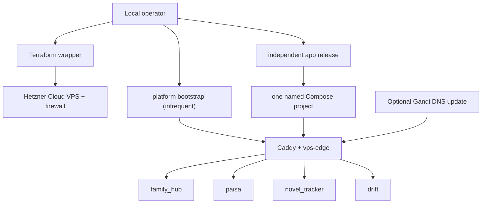

# VPS Deployment Infrastructure

This repo is a reusable deployment and operations toolkit for small self-hosted
apps. Terraform provisions the VPS layer, shared scripts prepare the server, and
app-specific Docker Compose deployments run behind a shared Caddy HTTPS proxy.

## Status

Active infrastructure repo for personal projects including `family_hub`,
`paisa`, `novel_tracker`, and `drift`. The scripts have been generalized so the app
deployment layer is provider-agnostic even though the current VPS is provisioned
on Hetzner Cloud.

## What It Provides

- Terraform configuration for VPS, firewall, SSH key, and deploy user
- Bitwarden-backed retrieval for the Hetzner Cloud token
- Shared Caddy platform with independently owned app route fragments
- Generic app deploy wrapper driven by Terraform outputs
- Optional Gandi LiveDNS record updates
- Compatibility wrappers for older Hetzner-specific script names
- A documented template for adding future Dockerized apps

## Architecture



## Repository Layout

```text
scripts/
  tf-hcloud.sh                    # Terraform wrapper with token lookup
  deploy-vps-platform.sh         # Provider-neutral one-time host platform
  deploy-vps-platform-from-tf.sh # Platform bootstrap using Terraform outputs
  deploy-vps-prod-from-tf.sh      # Deploy app using Terraform outputs
  deploy-vps-prod.sh              # Generic manual VPS deploy
  deploy-shared-caddy.sh          # Deprecated platform compatibility wrapper
  update-gandi-dns.sh             # Optional DNS update helper
  lib/app-registry.sh             # Known app/domain mapping
shared/
  main.tf                         # Hetzner server, firewall, SSH/deploy setup
  variables.tf                    # Infrastructure and domain inputs
  outputs.tf                      # Values consumed by deploy scripts
  cloud-init.yaml.tftpl           # Server bootstrap template
```

## Prerequisites

- `terraform`
- `bw` for Bitwarden token lookup
- `jq`
- `curl`
- SSH key pair for the deploy user
- Hetzner Cloud token stored in Bitwarden item `hetzner-hcloud-token`, field `token`
- Optional Gandi PAT for DNS updates

## Configure Terraform

```bash
cd shared
cp terraform.tfvars.example terraform.tfvars
```

Set the required values:

- `ssh_public_key_path`
- `admin_ipv4_cidrs` / `admin_ipv6_cidrs`
- app domains such as `family_domain`, `fitness_domain`, and `badge_creator_domain`
- `acme_email`

## Provision Infrastructure

```bash
./scripts/tf-hcloud.sh init
./scripts/tf-hcloud.sh plan
./scripts/tf-hcloud.sh apply
./scripts/tf-hcloud.sh output
```

## Deploy Apps

Bootstrap the host platform once (and only when platform configuration changes):

```bash
./scripts/deploy-vps-platform-from-tf.sh
```

Recommended Terraform-output flow:

```bash
FAMILY_HUB_IMAGE=ghcr.io/owner/repo/family-hub@sha256:... ./scripts/deploy-vps-prod-from-tf.sh family_hub main
PAISA_API_IMAGE=ghcr.io/owner/repo/paisa-api@sha256:... PAISA_WEB_IMAGE=ghcr.io/owner/repo/paisa-web@sha256:... ./scripts/deploy-vps-prod-from-tf.sh paisa main
NOVEL_API_IMAGE=ghcr.io/owner/repo/novel-tracker-api@sha256:... ./scripts/deploy-vps-prod-from-tf.sh novel_tracker main
DRIFT_API_IMAGE=ghcr.io/owner/repo/drift-api@sha256:... ./scripts/deploy-vps-prod-from-tf.sh drift main
```

With DNS update:

```bash
FAMILY_HUB_IMAGE=ghcr.io/owner/repo/family-hub@sha256:... \
  ./scripts/deploy-vps-prod-from-tf.sh --update-dns family_hub main
```

Manual deploy flow:

```bash
FAMILY_HUB_IMAGE=ghcr.io/owner/repo/family-hub@sha256:... \
./scripts/deploy-vps-prod.sh \
  family_hub \
  deploy \
  <server-ip> \
  https://github.com/biswashghi/family_hub.git \
  main
```

## Verify

```bash
curl -I https://family.bghimire.com
curl -f https://family.bghimire.com/api/health
curl -I https://fitness.bghimire.com
curl -f https://fitness.bghimire.com/api/health
curl -I https://badges.bghimire.com
```

## Adding A New App

1. Add the app to `scripts/lib/app-registry.sh`.
2. Give the app `compose.yml` plus local, staging, and production overlays.
3. Give the app a `scripts/deploy-vps.sh` compatible with the generic wrapper.
4. Add a domain variable/output if Terraform should manage the routing data.
5. Build and test an immutable image in the app repository, then deploy its
   digest with `deploy-vps-prod-from-tf.sh <app_name> main`.

## Design Notes

This repo separates infrastructure from application releases. Terraform owns the
server and firewall. The platform bootstrap owns Docker, Caddy, and the shared edge
network. Each app owns its Compose project, private state, and one validated Caddy
fragment. An app release never recreates the proxy or reads every other app's
configuration. See [SHARED_HOST_DEPLOYMENT.md](SHARED_HOST_DEPLOYMENT.md) for the
host contract and one-time cutover order.

## Security Notes

- Do not commit `terraform.tfvars` or Terraform state.
- Keep cloud provider and DNS tokens in a password manager or environment variables.
- Restrict SSH/firewall access through Terraform variables.
- Treat deployment scripts as operational code: review diffs before running them against production.
